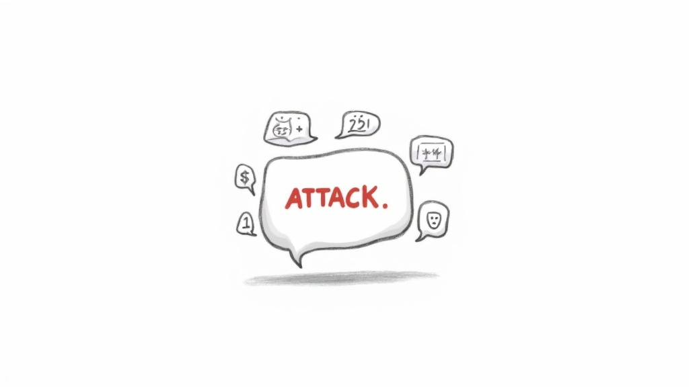
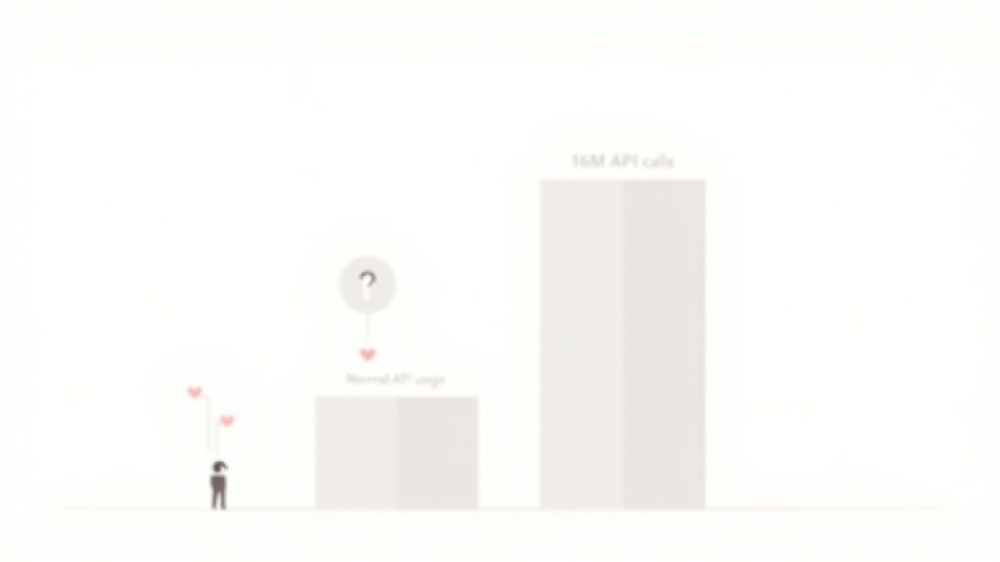

# Anthropic 急了？一条推文暴露的 AI 霸权焦虑

昨天半夜刷推，看到 Anthropic 官方发了条措辞严厉的指控：

> "我们发现 DeepSeek、Moonshot AI、MiniMax 对我们发起了工业级蒸馏攻击。这帮人造了 2.4 万个假账号，跟 Claude 聊了 1600 万轮，然后把 Claude 的能力偷去训练他们自己的模型。"

好家伙，直接点名三家中国公司。但仔细看这条推文，我第一反应不是"Anthropic 好惨"，而是——

**你们是不是有点太紧张了？**

---

## 马斯克说得对

评论里有条提到了马斯克，说"在这点上我同意马斯克"。虽然没贴出马斯克具体说了什么，但这个态度很说明问题。

马斯克一贯的观点是什么？
- AI 应该开源
- 技术壁垒是暂时的，竞争是好事
- 靠"保护"维持的优势，说明你没有真正的护城河

Anthropic 这波操作，恰恰印证了马斯克的判断。如果你真的技术领先，用得着发推文喊冤吗？

**真正强大的模型，不怕别人学。怕别人学的，说明也就那样。**

---

## 1600 万轮？中转 API 都不止这么多

 Anthropic 特意强调"1600 万轮对话"，想说明规模有多大。但等等——

**1600 万轮很多吗？**

对于做模型蒸馏的团队来说，这个数字真的不算夸张。一个中等规模的中文 AI 应用，日活用户聊个几百万轮很正常。更何况 DeepSeek 这种级别的团队，调用量只会更大。

而且 Anthropic 回避了一个关键问题：这些账号是**付费**的。

如果 DeepSeek 们是正常注册、正常充值、正常调 API，那 Anthropic 收了钱，转头说人家"欺诈"？

这逻辑就像是：开饭店的收了客人饭钱，然后抱怨"你们吃太多了，把我们的菜谱偷走了"。

**不是，你 API 定价的时候没算过成本吗？**

---

## 评论区的大型翻车现场

我原以为评论区会是"Anthropic 干得漂亮"，结果点进去一看——

**清一色的嘲讽。**

最高赞 251 个赞，就一句话：

> "HOW IS MODEL DISTILLATION STEALING 😭😭"

翻译成中文：**模型蒸馏怎么就成了偷窃，哭哭。**

底下有人算账：

> "Anthropic 花 80 亿美元未经许可训练 Claude，DeepSeek 花 0 美元未经许可训练 Claude。Anthropic 生气，是因为有人用更便宜的方式玩了他们自己的游戏。"

更狠的是前 GitHub 员工实名爆料：

> "我在 GitHub 工作的时候，我们不得不让你们停止过度使用我们的 API，因为你们违反 ToS 爬 GitHub 仓库。你们道了歉，然后继续这么做。"

**五十步笑百步，现场直播。**

---

## 真正让 Anthropic 慌的是什么？

表面上是"蒸馏攻击"，实际上 Anthropic 怕的是另一件事：

**中国模型崛起得太快了。**

DeepSeek、月之暗面、MiniMax，这三家有个共同点——都在短时间内搞出了跟 Claude 差不多的能力，而且成本低得离谱。

DeepSeek V2 出来的时候，圈内人都惊了：这效果，这价格，怎么可能？

Anthropic 的潜台词是：你们不是独立研发的，是抄我们的。

但问题是，**如果真的是"抄"就能抄出来，那说明你的技术壁垒也没多高。**

真正牛的模型，比如 GPT-4 刚出来的时候，有人能"蒸馏"出来吗？没有。因为差距太大了，蒸馏也没用。

现在 Anthropic 觉得"被蒸馏"了，恰恰说明 Claude 的优势没那么大了。

**不是别人太强，是你不够强。**

---

## 为什么发在 X 上，而不是上法庭？

这是一个特别值得玩味的细节。

如果 Anthropic 真的有证据，为什么不起诉？为什么要在社交媒体上"喊冤"？

答案很简单：**上法庭需要证据，发推文只需要情绪。**

Anthropic 想要的是舆论，不是正义。他们想让整个行业觉得"中国公司在偷我们的技术"，从而建立起一道道德护城河。

但评论区不买账，因为大家都看明白了：

**你们当年爬全网数据的时候，问过创作者的意见吗？**

这就像一个人偷了全世界的书，开了个图书馆收费，然后抱怨别人抄了他的读书笔记。

---

## 蒸馏到底是不是偷？

这里需要客观说一下。

模型蒸馏本身不是偷，是学术界公开的技术。Hinton 老爷子的论文摆在那，谁都可以学。

但"工业级蒸馏"确实是个灰色地带：
- 学术蒸馏：拿公开论文复现，没问题
- 商业蒸馏：海量调用竞品 API，用输出训练自己的模型，边界模糊

 Anthropic 的指控之所以站不住脚，是因为他们自己的边界也很模糊。

**他们的 ToS 里明确禁止用 API 输出训练竞争模型了吗？** 如果没有，那这个指控就是无理取闹。

更何况，就算禁止了，执行起来也是难题。你怎么判断一个模型是不是蒸馏出来的？Kimi 说它是 Claude，就说明它是蒸馏的？那万一是幻觉呢？

**技术上很难举证，法律上更难追责。**

所以 Anthropic 选择了舆论战。但舆论战的前提是——你得占理。

而评论区已经给出了答案：**不占理。**

---

## 最后的最后

用评论区的一条评论收尾：

> "DeepSeek V4 要发布了，Anthropic 慌了才放出这种指控。"

是不是"假指控"不知道，但"慌了"是真的。

AI 行业的格局正在重塑。过去一年，中国模型从"追赶者"变成了"并跑者"，甚至在某些场景下是"领跑者"。

这种变化，对于习惯了技术霸权的公司来说，确实很难接受。

**但历史不会同情落后者，只会奖励创新者。**

Anthropic 与其发推文抱怨，不如想想怎么把 Claude 做得更好。

毕竟，如果你的模型真的够强，谁还愿意去蒸馏你呢？

---

**P.S.** 评论区最毒舌的双关：
> "Rename Moonshot to Moonshine, it's illegally distilled"

Moonshine 是私酿酒。笑死。

---

*本文基于 Anthropic 官方推文及评论区公开内容整理。抓取工具：x-tweet-fetcher + Camofox。个人观点，欢迎讨论。*
