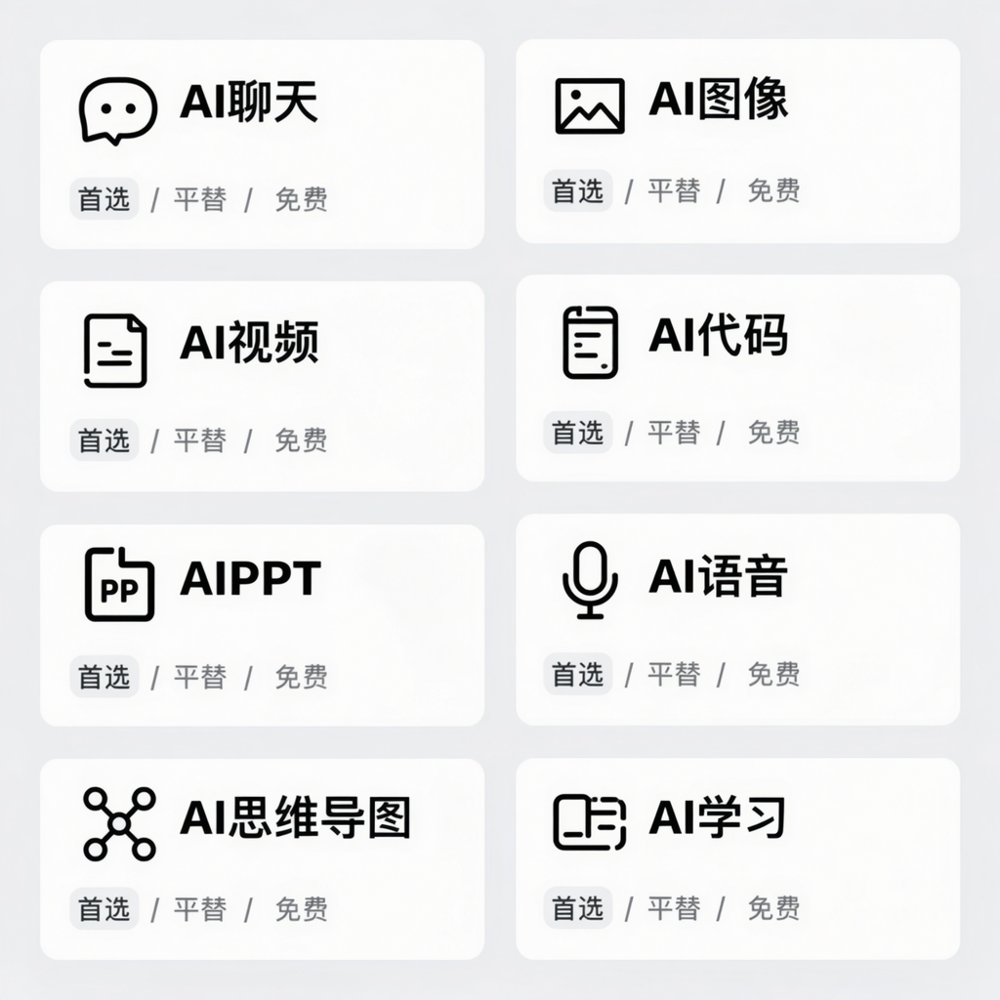
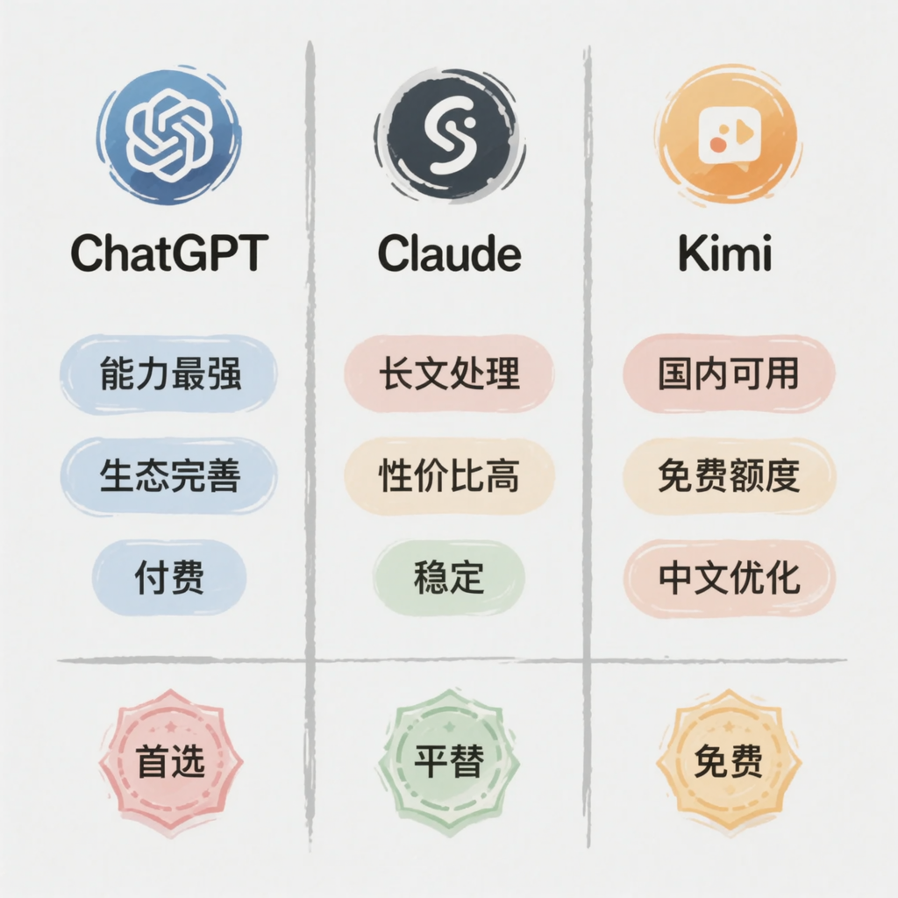
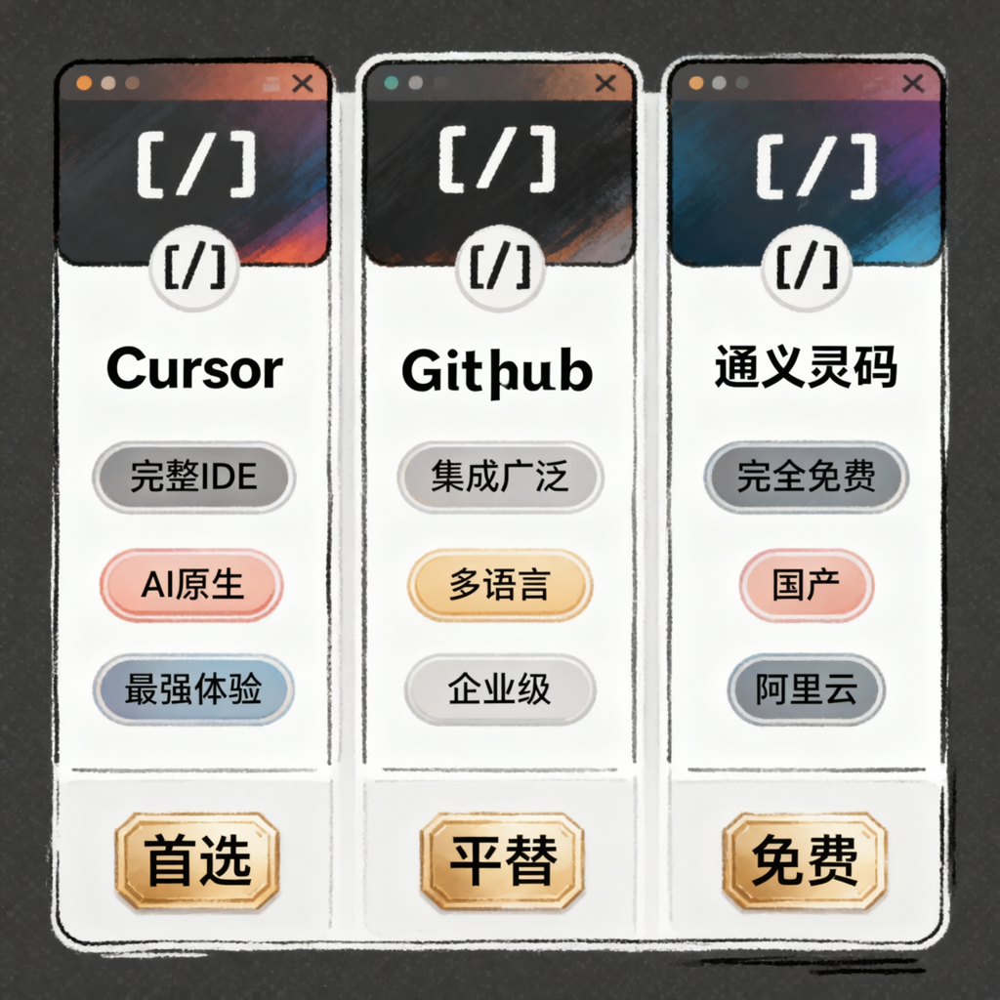
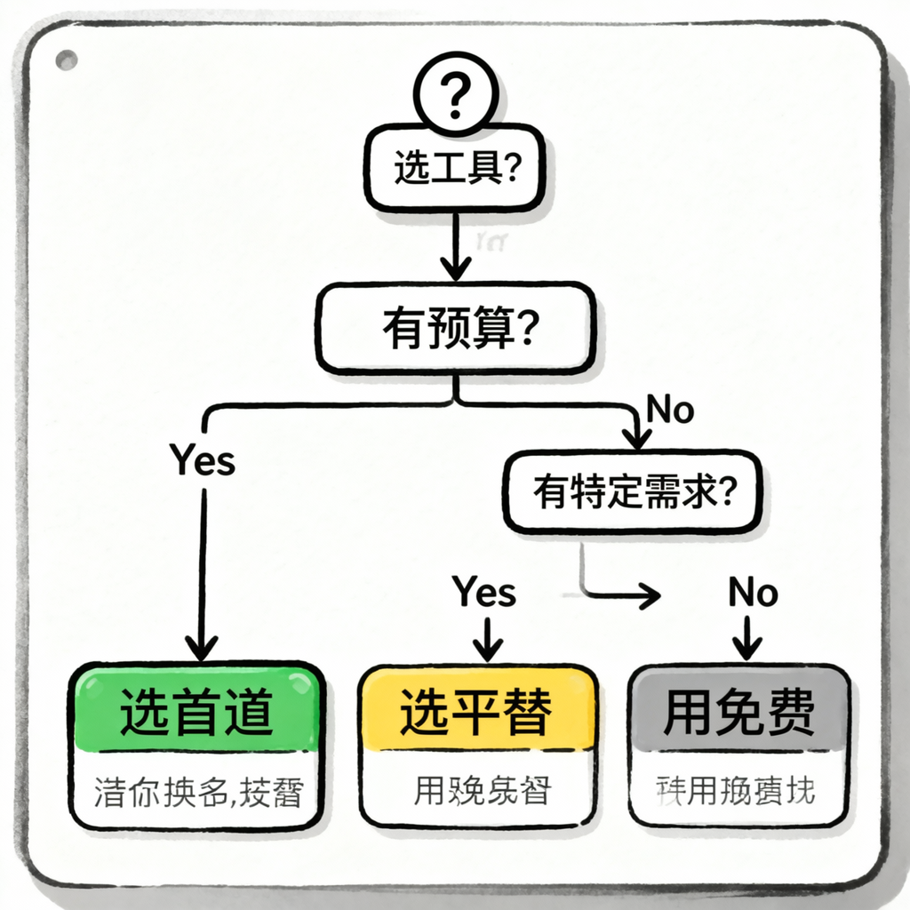

# 2026年AI工具大盘点：8大领域选哪个？

> 2026年该用什么AI工具？这篇帮你整理好了

## 写在前面

AI工具更新太快，到底该选哪个？本文整理了8大领域的常用AI工具，分为三个档次：**首选最强**、**平替够用**、**白嫖免费**。

---

## 一、AI聊天/写作助手

| 档次 | 推荐工具 | 特点 |
|------|----------|------|
| 首选 | ChatGPT (付费版) | 能力最强，生态完善 |
| 平替 | Claude | 性价比高，适合长文 |
| 免费 | Kimi / 智谱清言 | 国内可用，免费额度够用 |

---

## 二、AI图像生成

| 档次 | 推荐工具 | 特点 |
|------|----------|------|
| 首选 | Midjourney | 效果最强 |
| 平替 | Stable Diffusion | 本地可跑 |
| 免费 | Leonardo.ai | 每日免费积分 |

---

## 三、AI视频生成

| 档次 | 推荐工具 | 特点 |
|------|----------|------|
| 首选 | Sora / Runway | 效果领先 |
| 平替 | Pika | 操作简单 |
| 免费 | 可灵(快手) | 国内可用 |

---

## 四、AI代码助手

| 档次 | 推荐工具 | 特点 |
|------|----------|------|
| 首选 | Cursor | 完整IDE+AI |
| 平替 | GitHub Copilot | 集成广泛 |
| 免费 | 通义灵码 | 免费国产 |

---

## 五、AI PPT制作

| 档次 | 推荐工具 | 特点 |
|------|----------|------|
| 首选 | Gamma | 效果最佳 |
| 平替 | Beautiful.ai | 模板丰富 |
| 免费 | 讯飞智文 | 免费国产 |

---

## 六、AI语音/音频

| 档次 | 推荐工具 | 特点 |
|------|----------|------|
| 首选 | ElevenLabs | 效果最强 |
| 平替 | Azure TTS | 稳定可靠 |
| 免费 | 剪映AI配音 | 国内可用 |

---

## 七、AI思维导图

| 档次 | 推荐工具 | 特点 |
|------|----------|------|
| 首选 | Miro AI | 功能全面 |
| 平替 | GitMind | 国产免费 |
| 免费 | XMind AI | 简单够用 |

---

## 八、AI学习/科研

| 档次 | 推荐工具 | 特点 |
|------|----------|------|
| 首选 | NotebookLM | 文档分析神器 |
| 平替 | ChatPDF | 读取PDF |
| 免费 | Kimi | 长文本处理 |

---

## 总结建议

- **有钱任选首选**：追求最佳效果
- **省钱选平替**：性价比之选
- **没钱的免费**：白嫖也够用

> 记住：工具是死的，人是活的。找到最适合自己的，才是最重要的。

---

*本文持续更新，有新变化会及时更正*

📅 更新日期：2026-02-22
